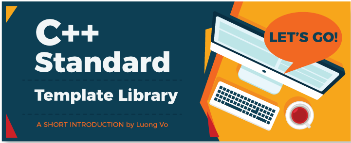

# Introduction to C++ STL
  
  
  
  

**Acknowledgement:** *Everything written below is from my own experience in college and after reading various materials. I am neither a professional nor expert, but a student who has great passion for the language. Anyone can open a discussion in the issue section, or a pull request in case something should be modified or added. If you consider my work valuable, a [donation](#donation) is much appreciated.*  

## What is C++ Standard Template Library 

* The C++ STL (Standard Template Library) is a powerful set of C++ template classes - or generic library, to provide general-purpose templatized classes and functions that implement many popular and commonly used algorithms and data structures. In a programmer's view, C++ standard template library provides more flexible solutions, more abstract evaluation of problems and more efficient implementation.   

* In short, C++ STL is the heart, the brightest gem of C++. It does come with some certain drawbacks, but let us discuss that later.

## C++ STL Composition

The core components of C++ STL comprises of **Containers, Iterators and Algorithms**.  

* Containers are used to managed differents kinds of object. Every container has its own pros and cons, which make it flexible due to the situation it is applied. Some popular name are deque, list, vector, map...
* Iterators are the tools for us to traverse or step through elements of containers. Iterators are common property of all containers, which make it generic and independent of the container type.
* Algorithm are operations used to process containers. A function call invokes a certain algorithm to do one job on one or many elements of a container (that may be accessed via iterators).  

Inside each of the above, there is even more to be considered. This introduction will try to cover as much as possible, in a concise way which triggers your curious mind and benefits you enough to start not just learning more but applying.  

## Index
Here is what I have covered : 
* [Vector](vector.md)
* [Deque](deque.md)

===================

A beer in your country can buy a meal in mine. 

