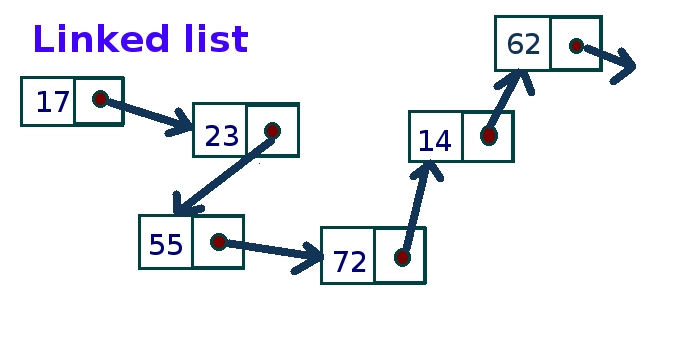
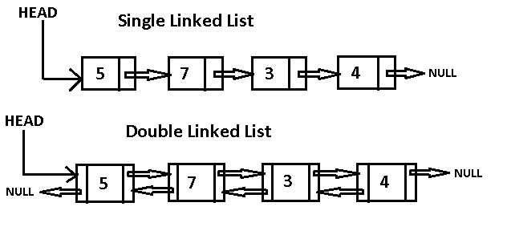
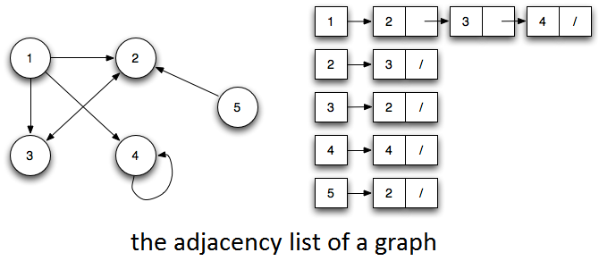

# Introduction to Forward List in C++


**Acknowledgement:** *Everything written below is from my own experience in college and after reading various materials. I am neither a professional nor expert, but a student who has great passion for the language. Anyone can open a discussion in the issue section, or a pull request in case something should be modified or added. If you consider my work valuable, a [donation](#donation) is much appreciated.*  

> Also, I highly recommend you read vector before this if you are new to C++ STL containers.  

## Table of contents  

1. [What is forward list](#what-is-forward-list)
2. [Operations on forward list](#operations-on-forward-list)


## What is forward list

To begin with, I thoroughly recommend you to look at [list](list.md). **Forward list** is based on the same concept that **list** is, which is called **linked list**. Inside [list](list.md) guide, I explained meticulously about how a **linked list** works, what it is, what its benefits are and some popular flavours of it.  

  

Basically, a **forward list** is a **singly linked list**.  

_It stores elements in different storage locations and keep them linked. The difference between **forward list** and **list** is the difference between **singly linked list** and **doubly linked list**. While the latter keeps track of each element's successor and predecessor, the former only cares about the next element. Maintain only one link per element helps reduce memory usage as well as boost the speed of inserting and removing elements (a little bit in some cases - compared to list)._   


However, **forward list** does come with uncomfortable drawbacks. It does share the same drawbacks with **list** (read back, please!). It doesn't provide `size()` operation ([here is why](http://stackoverflow.com/a/31822540)), `push_back()` operation ([here is why](http://stackoverflow.com/a/8742528)). Linking in one way makes it difficult to operate element that precedes...   

One of the case where you may consider using **forward_list** instantly is representing adjacency list of a graph. Other cases are where you want the standard **singly linked list** to sit it, but don't want to implement one yourself.




## Operations on forward list

Here I just highlight some key differences between **forward list** and **list**. Operations on **forward list** are mostly shared with **[list](list.md)**, which I describe carefully.  

* Forward list  doesn't provide `size()`. Still, `max_size()` is functional. 
* Forward list doesn't provide `push_back()`.
* No element can be accessed directly. There is only `front()` which returns the first element.
* Elements  can be accessed using ranged-base for loop or iterators.
* A unique function for insertion is added for forward list : `insert_after()`.  `erase_after()` is also used to erase elements from a particular position in the forward list.
* Removal, sort, merge... simmilar to [**list's special function.**](list.md#operations-on-list)
* For convenience, forward list offers an iterator `before_begin()` that points to the location before the beginning of the list.  
* `next()` is also useful in forward list when you want an iterator that points to an advanced position.

Here is an example for `insert_after`. This operation can take in position, values .... as parameters and return an iterator. 
```cpp
#include <iostream>
#include <vector>
#include <forward_list> // dont forget this
using namespace std; 
int main ()
{
  vector<int> vec(3,29);   // construct a vector with 3 elements 29
  forward_list<int> mylist;  // construct empty forward list
  forward_list<int>::iterator iter;

  iter = mylist.insert_after ( mylist.before_begin(), 0 );          // insert 0 at the beginning 
  cout << "1/ mylist now :";
  for (int& x: mylist) cout << ' ' << x;
  cout << endl;
  
  
  iter = mylist.insert_after ( iter, 2, 55 );                          //insert 2 elements 55 after the position of iterator 
  cout << "2/ mylist now :";
  for (int& x: mylist) cout << ' ' << x;
  cout << endl;
  
  iter = mylist.insert_after ( iter, vec.begin(), vec.end() );      // insert 3 elements from the vector  
  cout << "3/ mylist now :";
  for (int& x: mylist) cout << ' ' << x;
  cout << endl;
  
  iter = mylist.begin();                                              // reset to begin
  iter = mylist.insert_after ( iter, {1,2,3} );                        // insert an array afer begin       
  cout << "Finally, mylist now :";
  for (int& x: mylist) cout << ' ' << x;
  cout << endl;
}


/*output: 
1/ mylist now : 0
2/ mylist now : 0 55 55
3/ mylist now : 0 55 55 29 29 29
Finally, mylist now : 0 1 2 3 55 55 29 29 29
*/
```
You can run the code [here](http://cpp.sh/3dzyh).  
****
Example for `erase_after` : 
```cpp
#include <iostream>
#include <vector>
#include <forward_list> // dont forget this
using namespace std; 
int main ()
{
  vector<int> vec(3,29);   // construct a vector with 3 elements 29
  forward_list<int> mylist;
  forward_list<int>::iterator iter;

  iter = mylist.insert_after ( mylist.before_begin(), 0 );          // insert 0 at the beginning 
  cout << "1/ mylist now :";
  for (int& x: mylist) cout << ' ' << x;
  cout << endl;
  
  
  iter = mylist.insert_after ( iter, 2, 55 );                          //insert 2 elements 55 after the position of iterator 
  cout << "2/ mylist now :";
  for (int& x: mylist) cout << ' ' << x;
  cout << endl;
  
  iter = mylist.insert_after ( iter, vec.begin(), vec.end() );      // insert 3 elements from the array   
  cout << "3/ mylist now :";
  for (int& x: mylist) cout << ' ' << x;
  cout << endl;
  
  iter = mylist.begin();                                              // reset to begin
  iter = mylist.insert_after ( iter, {1,2,3} );                        // insert an array afer begin       
  cout << "Finally, mylist now :";
  for (int& x: mylist) cout << ' ' << x;
  cout << endl;
}

/* output : 
1/ mylist now : 0
2/ mylist now : 0 55 55
3/ mylist now : 0 55 55 29 29 29
Finally, mylist now : 0 1 2 3 55 55 29 29 29
*/
```
You can run the code [here](http://cpp.sh/64ul4).
****

Example for `before_begin()` :
```cpp
#include <iostream>
#include <forward_list> // dont forget this
using namespace std; 
int main ()
{
    forward_list<int> mylist = { 5,6,7,8,9,10 };  // construct a list
    forward_list<int>::iterator iter;
    
    iter = mylist.before_begin();           // will point to the slot before 5.
    mylist.erase_after(iter);            // will delete 5.
    mylist.insert_after(iter, 4);           // will insert 4.
    for (iter = mylist.begin(); iter!= mylist.end(); ++iter) {
        cout << *iter << " ";
    }
    cout << endl;
}

// output : 4 6 7 8 9 10 
```
You can run this code [here](http://cpp.sh/2ifhc)
****
Example with `next()` : 
```cpp
#include <iostream>
#include <forward_list> // dont forget this
#include <iterator>   // next() is a property of iterator library

using namespace std; 

// In this program you will see how next() and insert_after() cooperate
int main ()
{
    forward_list<int> mylist = { 5,6,7,8,10 };  // construct a list
    forward_list<int>::iterator currentPos;
    
    // Let's say you want to insert 9 after 8 before 10

    
    for ( currentPos = mylist.before_begin(); currentPos != mylist.end(); ++currentPos){
        if (*next(currentPos) == 10) {
            mylist.insert_after(currentPos, 9);
            break;
        }
    }
    
    for (currentPos = mylist.begin(); currentPos!= mylist.end(); ++currentPos) {
        cout << *currentPos << " ";
    }
    return 0;
}


//output : 5 6 7 8 9 10  
```
You can run the code [here](http://cpp.sh/8yuc)

----------
_This is the end!_ :smiley: _Have fun!_ :smiley:

##### Donation
[](https://www.paypal.com/cgi-bin/webscr?cmd=_s-xclick&hosted_button_id=5ZG5Z47L2ZGYC)
A beer in your country can buy a meal in mine.
