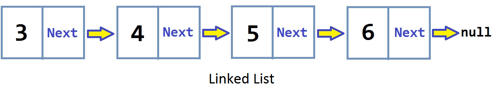
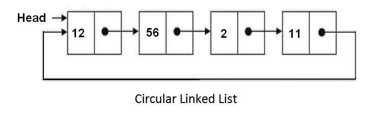
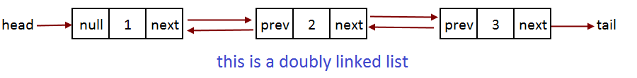
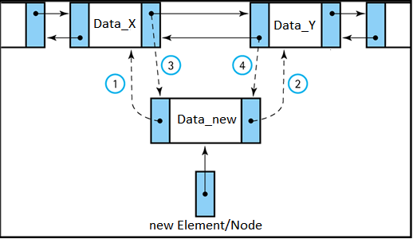
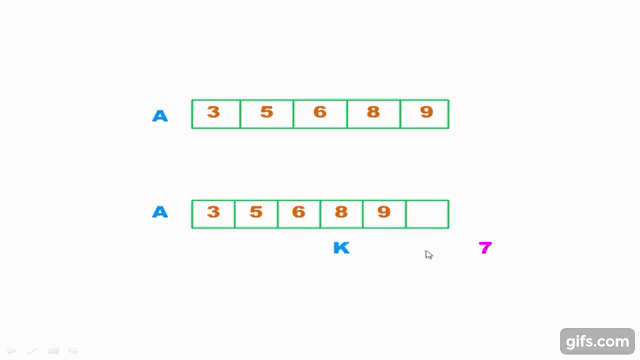

# Introduction to Deque in C++


**Acknowledgement:** *Everything written below is from my own experience in college and after reading various materials. I am neither a professional nor expert, but a student who has great passion for the language. Anyone can open a discussion in the issue section, or a pull request in case something should be modified or added. If you consider my work valuable, a [donation](#donation) is much appreciated.* 

> Also, I highly recommend you read vector before this if you are new to C++ STL containers.


## Table of Contents: 
1. [What is a linked list](#what-is-a-linked-list)
2. [List container in C++ STL](#list-container-in-c-stl)
3. [Operations on list](#operations-on-list)

## What is a linked list

C++ and many other languages support a sequence of data structures called **linked list**.  

**Linked list**, as its name suggests, is a **list** of data that is kept **linked** together. Basically, **linked list** and **array** are similar since they both store collections of data, but they differ a lot from their core and they exist to make up for each other's drawbacks.   



_While **array** is one of the most **convenient** and **popular** way to store and access data, programmers in the early days (when memory is expensive and limited) witnessed its disadvantages in allocation and dynamic behaviours, hence the birth of **linked list**._  

Comparing to **array**, **linked list** wins as:   

* Storing huge size of data doesn't require expensive allocation.
* Data can be kept on different blocks of memory.
* No initial size value should be defined.
* The size of a linked list is never fixed.

and loses when:  

* Accessing random elements ( there is no indices in linked list ).
* Inserting or removing elements at the front or in the middle.
* Storing very small data ( for instance : characters, boolean values).  

With C++, **pointers** are utilized to keep the **list** *linked*. Here is how **linked lists** usually look in real life:  
```cpp
struct Node {
	int data;			 // data we need to store.
	Node* next;          // this is a pointer that points to another node.
}

void insertFront (Node *head, int n) {      // this function inserts a node at the front 
	Node *newNode = new Node;
	newNode->data = n;
	newNode->next = head;   // link the new node to the head
	head = newNode;        // since head is no longer 1, we need to update it
}

int main() {
	Node* head = new Node;   // the first node of the list is often named "head"
	head->data = 1;
	head->next = NULL;    // this list has 1 element
	insertFront(head, 2);  // insert 2 at the front
}
```

Actually, there are 3 basic flavours of list that is popular these days : 

* Original Linked List - one way navigation : forward.
* Doubly Linked List - two way navigation : forward and backward.
* Circular Linked List - round navigation : last node linked to first node.



Basic understanding of **linked list** concept is crucial to start learning **list** container in C++ STL. If you wish to know more about **linked list** itself, you should search for more other materials.

## List container in C++ STL 

A **list** container manages its element the same way as a **doubly linked list**. This means each element is linked with the previous and the next one.    

  

When compared with vector and deque, one of the most notable drawback of **list** is that it __doesn't provide random element accessing__ ( index-based access ). For example, navigating to a n-index element requires you to go through n-1 elements via the links. It is surely less efficient, takes linear time, but a natural characteristic sacrifice of **list** since its birth.

*In exchange for the drawbacks, __insertion and removal__ at any position are fast (especially with large data, for more read [here](http://baptiste-wicht.com/posts/2012/12/cpp-benchmark-vector-list-deque.html)). Thanks to its **linking** nature, the requirement for insertion, for instance, is just editing some links between elements, not moving a bunch of others to make room for new one.*   

`List insertion vs array-like insertion`  

  


> This is why understanding linked list is crucial to list container.

## Operations on list

**List** shares many operations with other sequence containers like **vector** and **deque** (assign, push, pop, insert, erase...). If you are new to STL sequence containers, please read back my [vector](vector.md) to deeply understand these operations. A neat table that summarizes most operations is available in the [deque](deque.md) guide.  

**List**, nevertheless, does differ from the rest in some cases. 
- It doesn't provide the operator `at()` (*No random accessing, remember?*).  
- It doesn't provide operator for `capacity()` (*Because each element has its own memory, no redundancy like vectors*).
- It does provide `push_front()`, `pop_front()`, `push_back`, `pop_back` as deque. 
- Behind the scene, some operations like `insert` and `remove` are implemented differently from these of vectors or deques.
- The two direct element access methods allowed are: `front()` and `back()`.
- Iterators are only bidirectional.

The below example highlight some key points with list : 

```cpp
// Dont forget to include std list
#include <list>
using namespace std;
...


// default constructor
list<int> myList;
list<int> emptyList;
 
// construct a prefilled list
list<int> myList1(4, 50);
 
// copy constructor
list<int> copyMyList(myList);

// push some elements in
for(int i = 0; i < 10; i++)
	myList.push_back(100);

// DO NOT USE THIS
myList.at(2);    // 'class std::list<int>' has no member named 'at'

// pop
mylist.pop_back();      // = 100
mylist.pop_front();		// = 100

// direct access 
mylist.front();        // = 100
mylist.back();         // = 100

// BUT ....
emptyList.front();     // RUNTIME ERROR!
emptyList.back();      // RUNTIME ERROR!
```

**SOME SPECIAL FUNCTIONS WITH LISTS**  

_This is just a quick preview table. Each of these functions are not easy to apply but handy in some situations. Also, they possess many characteristics that need extra cares. If you are interested, there are other sources that cover these functions in details online._

| Functions                                                                       	| Meaning                                                      	|
|---------------------------------------------------------------------------------	|--------------------------------------------------------------	|
| void remove(value)                                                              	| Remove an element with a specific value                      	|
| void remove_if(Unary predicate)                                                 	| Remove elements that satisfy a condition                     	|
| void unique()                                                                   	| Remove duplicate values                                      	|
| void merge(list& source)                                                        	| Merge elements of two sorted lists                           	|
| void merge(list& source, compareFunc)                                           	| Also merge, but the lists are sorted by compareFunc function 	|
| void sort()                                                                     	| Sort the list using < operator                               	|
| void sort(compareFunc )                                                         	| Also sort but use a compare function to compare two elements 	|
| void splice(const_iterator i, list& source,const_iterator beginPos, const_iterator endPos) 	| Transfer elements from list to list                          	|

Despite that I have pitifully not mastered all of them, I can give you some examples of some functions which I usually use to see how they work. Please look at the below examples carefully:   

#### Removal 

```cpp
#include <iostream>
#include <list>
using namespace std ;
int main ()
{
    // create list
  int myArray[]= {15,16,17,15,26,37};
  list<int> myList (myArray,myArray+6);
    // remove number 15
  myList.remove(15);
    // print list
  cout << "myList contains: ";
  for (list<int>::iterator it=myList.begin(); it!= myList.end(); it++) {
     cout <<*it<<" ";
  }
  return 0;
}

``` 
*Run this code [here](http://cpp.sh/476hn).*

#### Splice 

```cpp
#include <iostream>
#include <list>
using namespace std ;
int main ()
{
  // create three lists for splicing 
  list<int> list1(4, 100);
  list<int> list2(6, 45);
  list<int> list3(5, 20);
  
  // create iterator for printing 
  list<int>::iterator it;
  // splice two lists: the whole list 2 into list 1 at the last position of list 1
  list1.splice(list1.end(), list2);
  
  // print the list 1
  cout<<"List 1: " ;
  for(it= list1.begin(); it != list1.end() ; it++) {
    cout<<*it<<" " ;
  }
  cout << endl;
  
  //create iter for list3 
  list<int>::iterator startPos = list3.begin();
  list<int>::iterator stopPos = startPos ;
  advance(stopPos, 3);   // advance is a void function to advance iterator
  
  //splice two list, list 3 from the begin to the middle into list 2 at the position
  list2.splice(list2.end(), list3, startPos, stopPos);
  
  // print the list 2
  cout<<"List 2: " ;
  for(it= list2.begin(); it != list2.end() ; it++) {
    cout<<*it<<" " ;
  }
  // Here we can see that after splicing, the list2 is empty.
  // This is why printing list2 will just print out 3 values of list 3 that we splice into it.
  cout << endl;
  
  // print the list 2
  cout<<"List 3: " ;
  for(it= list3.begin(); it != list3.end() ; it++) {
    cout<<*it<<" " ;
  }
  //the same rule applied for list3. It now has only 2 elements left after splicing.
  cout << endl;
}
```
*Run this code [here](http://cpp.sh/66rr).*

#### Remove_if 

```cpp
#include <iostream>
#include <list>
using namespace std ;


// a predicate can be a class/ a struct or a boolean function. 
// Here I will make a boolean function 
bool even_digit(const int& val) {
    return (val%2)==0;
}

// Here is a class 
class odd_digit {
   public : bool operator() (const int& val) {
      return (val%2)==1;
    }
};
 
int main ()
{
  // create list from an array
  int myArray[]= {2,44,67,221,69,31,24,93,-5};
  list<int> list1(myArray,myArray+9);
  
  // create iterator for printing 
  list<int>::iterator it;
  
  //remove even numbers
  list1.remove_if(even_digit);
  
  // print the list 1
  cout<<"List 1 without even digits: " ;
  for(it= list1.begin(); it != list1.end() ; it++) {
    cout<<*it<<" " ;
  }
  cout<< endl;
  
  //remove even numbers
  // remember the "()" for class
  list1.remove_if(odd_digit());
  
   // print the list 1
  cout<<"List 1 without even digits and odd digits: " ;
  for(it= list1.begin(); it != list1.end() ; it++) {
    cout<<*it<<" " ;
  }
  
}
```
*Run this code [here](http://cpp.sh/8obvj).*  

#### Sort  

```cpp
#include <iostream>
#include <list>
using namespace std ;


// a predicate can be a class/ a struct or a boolean function. 
// Here I will make a boolean function 
bool descendingSort(const int& val1, const int& val2) {
    return (val1 > val2);
}

 
int main ()
{
  // create list from an array
  int myArray[]= {11, 44, 6, 13, 55, 92, 56, 10, 0};
  list<int> list1(myArray,myArray+9);
  
  // create iterator for printing 
  list<int>::iterator it;
  
  //Ascending sort
  list1.sort();
  
  // print the list 1
  cout<<"List 1 default ascending sort: " ;
  for(it= list1.begin(); it != list1.end() ; it++) {
    cout<<*it<<" " ;
  }
  cout<< endl;
  
  //Custom descending sort
  list1.sort(descendingSort);
  
  // print the list 1
  cout<<"List 1 descending sort: " ;
  for(it= list1.begin(); it != list1.end() ; it++) {
    cout<<*it<<" " ;
  }
  cout<< endl;
  
}
```
*Run this code [here](http://cpp.sh/8q4t).*  

#### Unique  
```cpp
#include <iostream>
#include <list>
using namespace std ;


// a predicate can be a class/ a struct or a boolean function. 
// Here I will make a boolean function 
bool myfunc(const int& val1, const int& val2) {
    return (val1==val2);
}

 
int main ()
{
  // create three lists from an array
  int myArray[]= {2,2,2,221,2,2,24,93};
  list<int> list1(myArray,myArray+8);
  
  // create iterator for printing 
  list<int>::iterator it;
  
  //for accurate result, we must sort the list
  list1.sort();
  
  //remove duplicate according to myfunc
  list1.unique(myfunc);
  
  // print the list 1
  cout<<"List 1 without duplicate digits: " ;
  for(it= list1.begin(); it != list1.end() ; it++) {
    cout<<*it<<" " ;
  }
  cout<< endl;
}
```
*Run this code [here](http://cpp.sh/8cq5).*  

#### Merge
```cpp
#include <iostream>
#include <list>
using namespace std ;


// a predicate can be a class/ a struct or a boolean function. 
// Here I will make a boolean function 
bool descendingSort(const int& val1, const int& val2) {
    return (val1 > val2);
}

 
int main ()
{
  // create two lists from an array
  int myArray[]= {11, 44, 6, 13, 55, 92, 56, 10, 0};
  list<int> list1(myArray,myArray+9);
  
  int myArray2[]= {23, 67, 63, 4, 52, 45, 19, 91};
  list<int> list2(myArray2,myArray2+8);
  
  // one other list copy list1 
  list<int> list3(list1);
  
  // create iterator for printing 
  list<int>::iterator it;
 
  
  //Ascending sort
  list1.sort();
  list2.sort();
  list1.merge(list2);  // will retain list 1 sorted ( default ascending sorting method )
  
  // print the list 1
  cout<<"List 1 after merge (default sort) : " ;
  for(it= list1.begin(); it != list1.end() ; it++) {
    cout<<*it<<" " ;
  }
  cout<< endl;
  
  //after merge list 2 will lose all its elements. 
  cout<<"List 2 after merge into list 1: " ;
  for(it= list2.begin(); it != list2.end() ; it++) {
    cout<<*it<<" " ;
  }
  cout <<endl;
  
  //reconstruct list2 with list4
  list<int> list4(myArray2,myArray2+8);
  
  // Custom Descending sort
  list4.sort(descendingSort);
  list3.sort(descendingSort);
  list4.merge(list3, descendingSort); // will retain list 2 sorted (custom descending sorting method )
   
  
  // print the list 4
  cout<<"List 4 after merge (custom descending sort): " ;
  for(it= list4.begin(); it != list4.end() ; it++) {
    cout<<*it<<" " ;
  }
  cout<< endl;
}
```
*Run this code [here](http://cpp.sh/7zf2).*  

-------
_This is the end!_ :smiley: _Have fun!_ :smiley:

##### Donation
[](https://www.paypal.com/cgi-bin/webscr?cmd=_s-xclick&hosted_button_id=5ZG5Z47L2ZGYC)
A beer in your country can buy a meal in mine.